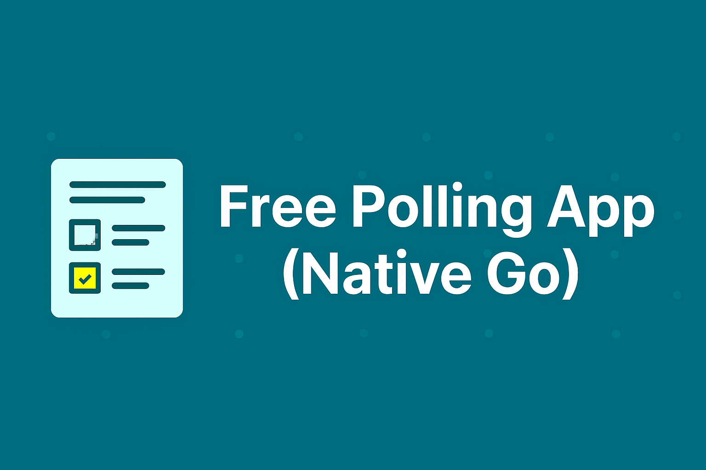

A lightweight backend service for managing polling workflows, implemented in native Go using the standard `net/http` library.


## 📘 API Endpoint

| Endpoint                                 | Method | Description                                                                 |
|------------------------------------------|--------|---------------------------------------------------------------------------|
| `/register`                         |    | Registers a new user with email, name, and password.                 |
| `/login`                            |   | Authenticates user and returns a JWT token for secure access.              |
| `/pollings`                              |    | Creates a new poll with title, options, and start/end timestamps.               |
| `/pollings/{id}`                         |     | Fetches detailed information about a specific poll.      |
| `/pollings/{id}`                         |     | Updates an existing poll. Only the creator can modify title, options, or timestamps.      |
| `/pollings/{id}`                         |     | Deletes a poll. Only the creator is authorized to remove it.      |
| `/pollings/{id}/vote`                    |    | Submits a vote for specific poll option.    |
| `/pollings/{id}/result`                  |     | Returns the voting results for a specific poll.              |     |
| `/users/me`                              |     | Retrieves profile information of the currently authenticated user.           |
| `/users/me`                              |     | Updates the profile information of the currently authenticated user.           |
| `/users/me/change-password`                              |     | Changes the password of the currently authenticated user.          |
| `/users/me/pollings/created`            |     | Retrieves a list polls created by the logged-in user.        |
| `/users/me/pollings/voted`              |     | Retrieves a list polls voted on by the logged-in user.  |

## 📄 API Documentation (Swagger)

This project uses Swagger (OpenAPI) to document its RESTful API endpoints.

### 🔍 How to Access

You can view the API documentation in two ways:

#### 1. **Via Swagger Editor (Online Preview)**
1. Open [Swagger Editor](https://editor.swagger.io)
2. Click **File → Import File**
3. Select `docs/swagger.yaml` from this repository
4. The interactive documentation will be rendered automatically

#### 2. **Directly from GitHub**
- Navigate to [`docs/swagger.yaml`](docs/swagger.yaml)
- GitHub will display the raw YAML content
- You can copy and paste it into Swagger Editor or other OpenAPI tools

---

## 🧰 Tech Stack

| Layer           | Technology                     | Description                                      |
|----------------|----------------------------------|--------------------------------------------------|
| Language        | [Go](https://golang.org/)       | Main programming language using `net/http`       |
| HTTP Router     | Native `net/http`               | Lightweight HTTP server without external framework |
| Database        | PostgreSQL                      | Relational database for storing polls and users  |
| Auth            | JWT (JSON Web Token)            | Stateless authentication for protected endpoints |
| Environment     | `github.com/joho/godotenv`      | Loads `.env` configuration into Go environment   |
| Documentation   | [Swagger (swaggo)](https://github.com/swaggo/swag) | Auto-generates API docs from Go comments         |
| Testing         | `testing`, `testify`, `sqlmock` | Unit testing with mocks and assertions

## 🧱 Architecture Overview

This project follows a clean layered structure using native Go (`net/http`):
- **Handler Layer**  
  Maps HTTP routes to logic, parses requests, and returns responses.

- **Service Layer**  
  Contains core business logic for polling, voting, and validation.

- **Repository Layer**  
  Handles direct database access using raw SQL.

### 📦 Example `.env` file

```env
APP_HOST=localhost
APP_PORT=3000

DB_HOST=localhost
DB_PORT=5432
DB_USER=polling_user
DB_PASSWORD=securepass
DB_NAME=polling

JWT_KEY=superscreet
```